# Chapter 2: Physical Data Modeling

## 2.5 Translating Subclasses
> Relational Model itself is not object-oriented. Therefore, object features were added to new data models to support constructs from OOP (e.g., subclassing).

### Options for Representing Subclasses
- ER Approach
- Object-oriented Approach
- Null-value Approach

When deciding which option to use, we need to consider the performance for common queries as well as the space implications.

### Option 1: ER Approach
The ER model suggests that:
- a subclass entity has its own additional attributes, and
- it relates to the superclass via the "is-A" relationship.

Therefore, we may represent the subclass as a separate relation with only the additional attributes. This relation can be linked back to the superclass relation via its key.
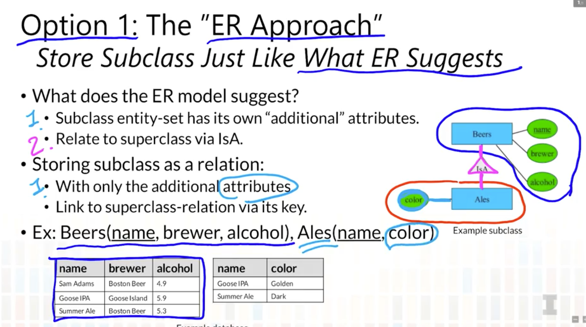
Note that the new attribute "color" is stored in a separate table `Ales` from the main `Beers` table. They can be linked by the `name` attribute.

### Option 2: OO Approach
The object-oriented model suggests that:
- a subclass should _inherit_ all attributes from the superclass.

Therefore, we may store the subclass as a separate relation from the superclass, with all of its attributes inherited from the superclass, as well as its own attributes.
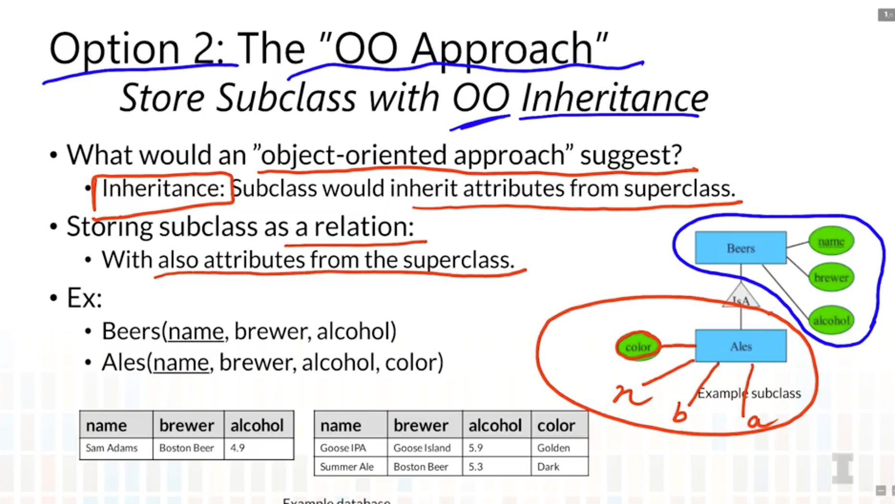

### Option 3: Null-Value Approach
The main idea behind this approach is "one size fits all".

Therefore, we represent the subclass in the same relation as the superclass. This relation will have all the attributes in both the subclass and the superclass. For places where an attribute doesn't apply, simply use the value `NULL` to signify that.
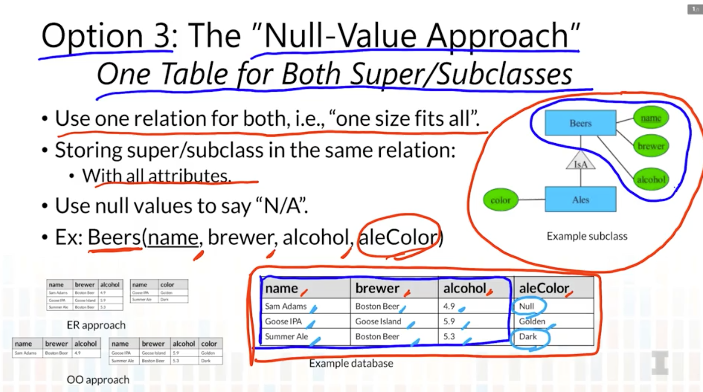

### Deciding on an Option
Different queries will benefit from different modeling choices. For example, the query on color of ales will require a different sequence of operations from the query on the beer produced by a brewer in the following example:
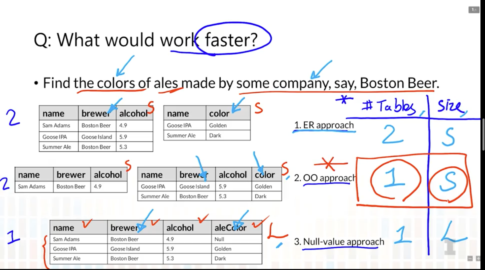

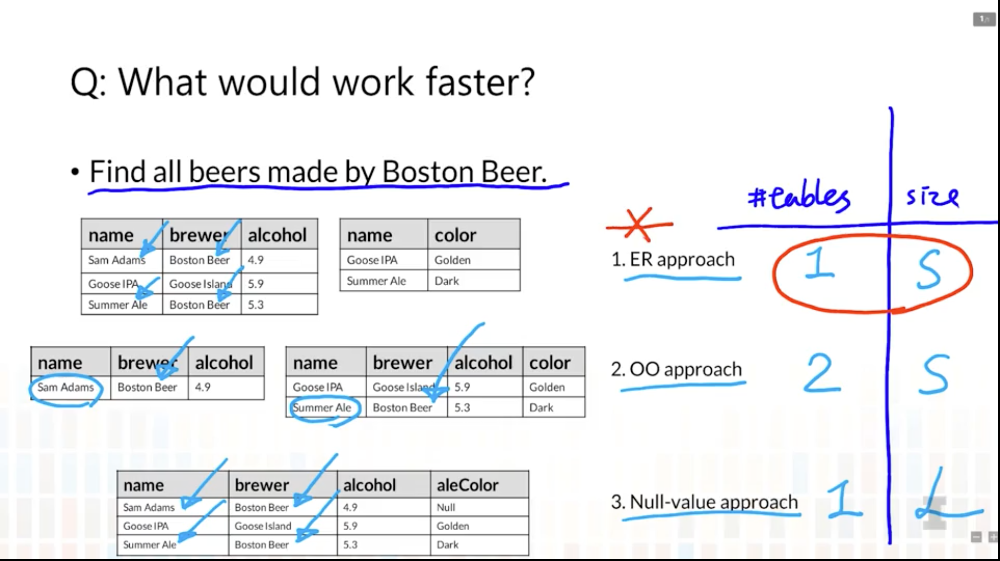

## 2.6 Post-Relational - Object-base Modeling
An irreconcilable difference when an application is interacting with a database is __object-relation impedance mismatch__. This refers to the difference between objects, which exists in the world of applications and tuples, which is introduced in the world of relations. Specifically, the differences may be categorized as:
- __identifiers__: objects can be uniquely identified by pointers, whereas tuples can only be distinguished by values
- __nesting__: objects can support nesting but tuples can only store simple valuse
- __methods/functions__: objects can contain methods but tuples only have attributes
- __inheritance__: objects (classes) may inherit from a superclass but relations cannot
- __encapsulation__: objects can hide internal implementation but tuples cannot

# Chapter 3: Computing on Data
## 3.1 Computing on Data
> Why do we need computing on data?
> 
> Because often the data cannot be used "as-is". We need computing to transform them into the format that is usable to us.

The exact computing operation will depend on the physical data model involved, e.g., relations, key-value pairs, documents, or graphs. Some computing operations are:
- relational data:
  - relational algebra (fonudation of the SQL language)
  - datalog (a logical programming language for querying)
- graph data:
  - any operations that can be applied to graphs (finding neighbours, shortest paths, etc.)
- key-value data:
  - MapReduce

## 3.2 Relational Algebra
### Algebra
An __algebra__ is a mathematical system with 
- operands: values to be operated upon
- operators: symbols denoting the operation to be performed over operands and generates new values.

### Relational Algebra Overview
- Operands: relations
- Operators:
  - reduction: to make one relation smaller 
    - selection
    - projection
  - combination: to combine two relations
    - set operators (union, difference)
    - cartesian product
  - renaming: to change attribute names
  - other derived operators:
    - set intersection
    - joins

## 3.3 Relational Algebra - Basic Operators 1
See [3.4]() and [3.5]() for detailed introduction to basic operators

## 3.4 Relational Algebra - Basic Operators 2

### Reduction Operators
- For reducing rows, we use the _selection operator_ $\sigma$.
- For reducing columns, we use the _projection operator_ $\pi$.

### Selection $\sigma$
- Notation: $\sigma_c(R)$, where:
  - $R$ is an input relation
  - $c$ is a condition: $=,<,>,and,or,not$
- The output is a subset of $R$ that satisfies the condition $c$. The schema is the same as $R$.

### Projection $\pi$
- Notation: $\pi_{A_1, ..., A_n}(R)$, where:
  - $R$ is an input relation with schema $R(B_1, ..., B_n)$
  - ${A_1, ..., A_n} \subseteq {B_1, ..., B_n}$
- The output is a relation with attribute ${A_1, ..., A_n}$ from $R$.
  - Duplicates are removed (because the resulting relation forms a set).

## 3.5 Relational Algebra - Basic Operators 3

### Combination Operators
We can combine relations along the row or the column.
- To combine relations along the row, we can use the two set operations: _union_ and _difference_.
- To combine relations along the column, we use the _cartesian product_ operator.

### Set Union
- Notation: $R_1 \cup R_2$, where:
  - $R_1$ and $R_2$ are input relations with the same schema
- The output is a new relation with all tuples in $R_1$ and $R_2$ with no duplicates. The schema is the same as $R_1$ and $R_2$.

### Set Difference
- Notation: $R_1 - R_2$, where:
  - $R_1$ and $R_2$ are two input relations with the same schema
- The output is a new relation with all tuples in $R_1$ but not in $R_2$.

### Cartesian Product
- Notation: $R_1 \times R_2$, where:
  - $R_1$ is a relation with attributes $R_1(A_1, ..., A_n)$
  - $R_2$ is a relation with attributes $R_2(B_1, ..., B_m)$
- The output is a relation consisting of all pairs of tuples from $R_1$ and $R_2$. The schema is $(A_1, ..., A_n, B_1, ..., B_m)$.
- We typically need to do extra selection and projection to refine the resulting relation from a Cartesian Product to make it useful.
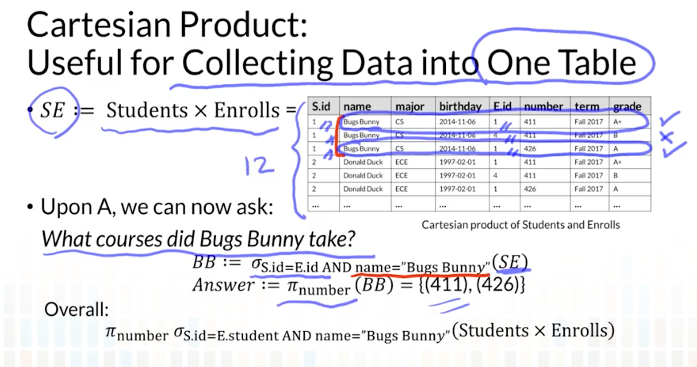

## 3.6 Relational Algebra: Basic Operator for Renaming Schema

### Renaming
- Notation: $\rho_{S(B_1, ..., B_n)}(R)$, where:
  - $R$ is an input relation $R(A_1, ..., A_n)$
- The output is the same relation instance as the input, with the relation name changed to $S$ and attribute names renamed to $(B_1, ..., B_n)$.

## 3.7 Relational Algebra: Derived Operators

### Set Intersection
- Notation: $R_1 \cap R_2$
- Everything else is similar to set union.
- This is derivable from the set difference operator.
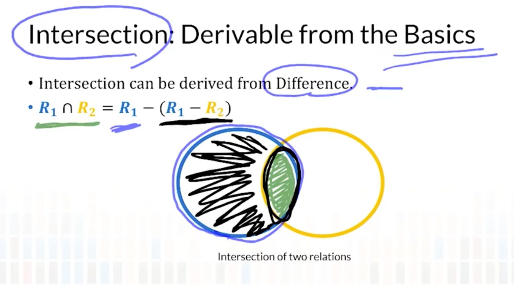

### Theta Join
- Notation: $R_1 \bowtie_\theta R_2$, where:
  - $R_1(A_1, ..., A_n)$ and $R_2(B_1, ..., B_m)$ are input relations
  - $\theta$ is a condition over $R_1$ and/or $R_2$'s attributes
- The output is the product of $R_1$ and $R_2$ filtered by the condition $\theta$. That is, this can also be expressed as $\sigma_\theta(R_1\times R_2)$.
- The output schema is $(A_1, ..., A_n, B_1, ..., B_m)$.

### Natural Join
- Notation: $R_1 \bowtie R_2$, where:
  - $R_1(A_1, ..., A_n)$ and $R_2(B_1, ..., B_m)$ are input relations
- The output is all pairs of tuples from $R_1$ and $R_2$ that are matched on their 'common' attributes $\{A_1, ..., A_n\} \cap \{B_1, ..., B_m\}$, a.k.a., the join attributes.
- The output schema is $\{A_1, ..., A_n\} \cup \{B_1, ..., B_m\}$, which is the resulting set of attributes after we merged the common attributes.

## 3.8 MapReduce for Key-Value Data

### MapReduce
MapReduce was created by Google in 2004 for simplified data processing over large clusters. Apache Hadoop is an example implementation.

We can apply the MapReduce model in database computing. Suppose we have a database $DB=[e_1, ..., e_n]$, where $e_i=(k_i,v_i)$ is a key-value pair. The model has the following steps:
- __Map__: apply function $M$ on each data entry $(k_i, v_i)$ in the database to produce a new list of values $[(k_{i1}, v_{i1}),...,(k_{im},v_{im})]$.
  - Note that in practice, for every single key-value pair $(k_i,v_i)$, the map fuction applied to that key-value pair $M(k_i,v_i)$ may produce a _list_ of new key-value pairs, a _single_ key-value pair, or _no values_ at all.
- __Group__: organize the new list of key-value pairs from the result of the _map_ operation by key $k_{ij}$ so that each group is of the form $(k_{ij}, [\text{values with key } k_{ij}])$
- __Reduce__: apply the reduce function $R$ on the new list of key-value pairs, so that each item will become $[k_{ij}, R(\text{values with key } k_{ij})]$

An example of MapReduce in selecting data in a relational database:
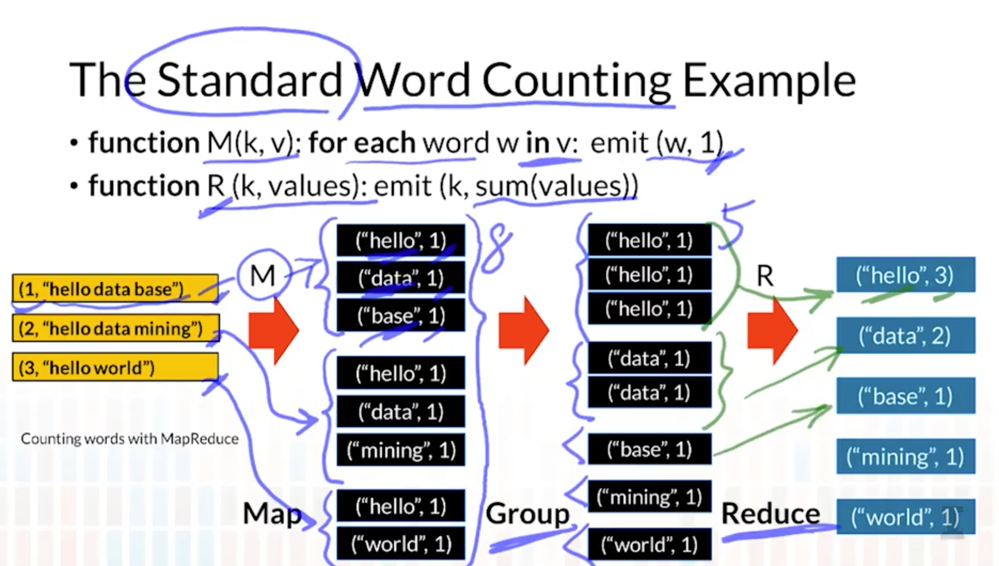

## Chapter Summary & Misc.
- The aggregate functions (e.g., sum, median, count, etc.) cannot be implemented in standard relational database because they require 'memory' to accumulate information across different tuples as the processing goes through. 

# Chapter 4 Designing Schemas
## 4.1 Designing Schemas
A badly designed schema may lead to _redundancy_, _update anomaly_, and _loss of facts_. Specifically,
- redundancy refers to the storage of duplicate information, 
- update anomaly refers to the case when we update such duplicated information, we may not remember to update all occurrences of the value, causing inconsistency, and
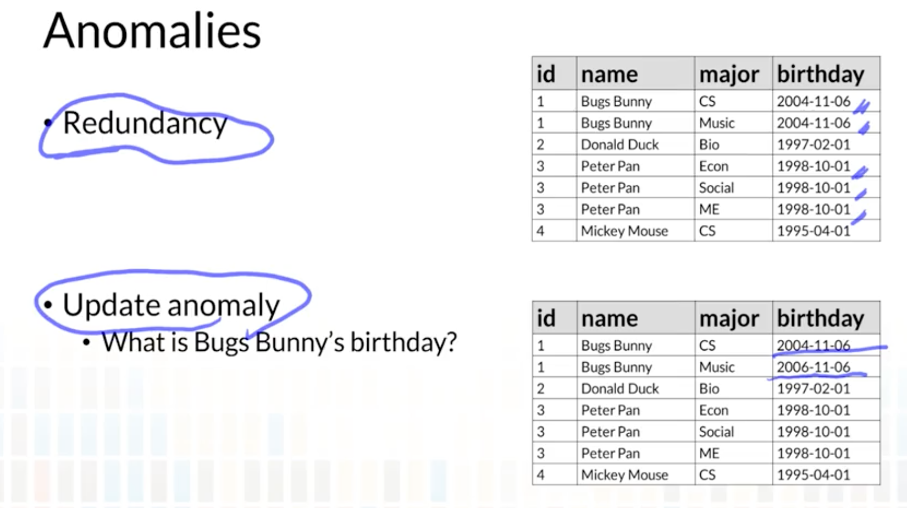
- loss of facts refers to the possibility that the student may not have a major, thus we will need to remove the tuple for that student, losing their birthday information.
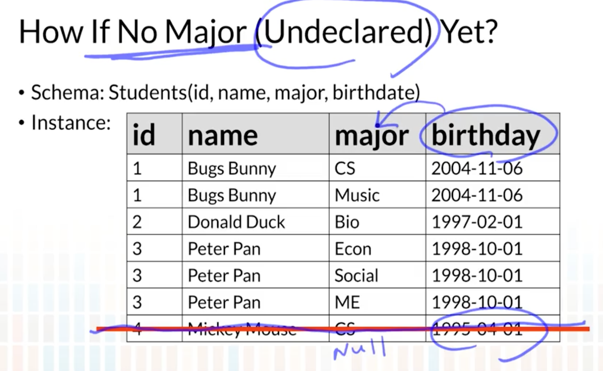

### Questions we are trying to answer
- How do we consider a schema good? (Normal forms)
- How do we transform a bad schema to a good one?

## 4.2 Functional Dependencies (FD)
Functional dependenies are a form of constraints. They need to be part of a schema.

### Definition
- Notation: $A_1, ..., A_m \rightarrow B_1, ..., B_n$
- We say $A_1, ..., A_m$ __functionally determines__ $B_1, ..., B_n$
- This means that as long as the values for $A_1, ..., A_m$ are fixed for tuples, then their values for $B_1, ..., B_n$ must also agree. That is, the mapping from $A_1, ..., A_m$ to $B_1, ..., B_n$ is __functional__ (many-to-one) (这里取函数式的意思).
- FD depends on your knowledge of the domain!

## 4.3 Keys (Formal Definition)
### Definition
A __key__ of a relation $R(A_1, ..., A_n)$ is a set of attributes $K$ that:
- functionally determines all attributes of $R$, that is, $k \rightarrow A_1, ..., A_n$, and
- none of its subsets does

A set of attributes containing a key is called a _superkey_.

## 4.4 Reasoning with FDs
### Basic Rules on FDs: Armstrong's Axioms
- Reflexivity Rule:
  - If $B\subseteq A$, then $A\rightarrow B$
- Augmentation Rule:
  - If $A\rightarrow B$, then $AC \rightarrow BC$
- Transitivity Rule:
  - If $A\rightarrow B$ and $B\rightarrow C$, then $A\rightarrow C$

### Derived Rules
- Splitting Rule
  - If $A\rightarrow BC$, then $A\rightarrow B$ and $A\rightarrow C$
- Combining Rule
  - If $A\rightarrow B$ and $A\rightarrow C$, then $A\rightarrow BC$

  drinker, bar -> price ?
  drinker, bar -> beer (given)
  bar, beer -> price (given)
  drinker, bar, beer -> drinker, price (augmentation)
  drinker, bar -> drinker, bar, beer (reflexivity)
  drinker, bar -> drinker, price (transitivity)
  drinker, bar -> price (splitting)

## 4.5 Attribute Closures
We were asking the question "whether {drinker, bar} can determine all attributes given some FDs" earlier, i.e., whether they form a superkey. Now, we are going to ask: "what attributes can {drinker, bar}" determine? This is called the __closure__ of "{drinker, bar}".

### Definition
- Notation: $\{A_1, ..., A_n\}^+ = \{B_1, ..., B_m\}$
- This is interpreted as: the closure of $\{A_1, ..., A_n\}$ is $\{B_1, ..., B_m\}$.
- This means that $\{B_1, ..., B_m\}$ is the maximal set of attributes that can be determined from the set of attributes $\{A_1, ..., A_n\}$ and dependencies $F$.

### Algorithm for Finding Closures
Given a set of attributes $\{A_1, ..., A_n\}$ for which we are determining the closure and a set of dependencies $F$, let $C = \{A_1, ..., A_n\}$ be the closure. We repeat the following step until $C$ no longer changes:
- If there is a rule $X_1, ..., X_m\rightarrow Y$ in $F$, and $X_1, ..., X_m$ are all in $C$, and $Y$ is not in $C$:
  - $C:=C+Y$

## 4.6 Normal Forms
When refining schemas, we want to maintain the following properties:
- minimize redundancy
- avoid information loss
- preserve dependency
- ensure good query performance

### First Normal Form
In the __first normal form__ (1NF), each attribute contains only single atomic value (i.e., no lists).

## 4.7 Boyce-Codd Normal Form (BCNF)
### Definition
- A relation $R$ is in BCNF if and only if for every _nontrivial_ FD for $R$ of the form $A\rightarrow B$, $A$ is a superkey for $R$.
- A _trivial_ FD $A\rightarrow B$ is one such that $B\subseteq A$.
- Effectively, BCNF ensures that there are no _bad_ FDs (i.e., when we have $A\rightarrow B$ but $A$ is not a superkey).

### BCNF Decomposition
When a relation $R$ is not in BCNF, we wish to have a way to transform it into BCNF.

#### The Algorithm
- Input: Relation $R(A,B,C)$, FDs $F$
- If there exists an FD $A\rightarrow B$ that is _bad_, then
  - decompose $R(A,B,C)$ into $R_1(A,B)$ and $R_2(A,C)$
  - compute new FDs for $R_1$ and $R_2$ as $F_1$ and $F_2$
  - Return $\text{BCNF }(R_1, F_1) \cup \text{BCNF }(R_2, F_2)$
- Else,
  - Return $R$ as is

## 4.8 Lossless Decomposition
Decompositions may be lossy, in that the split relations may not join back to a relation equivalent to the original relation.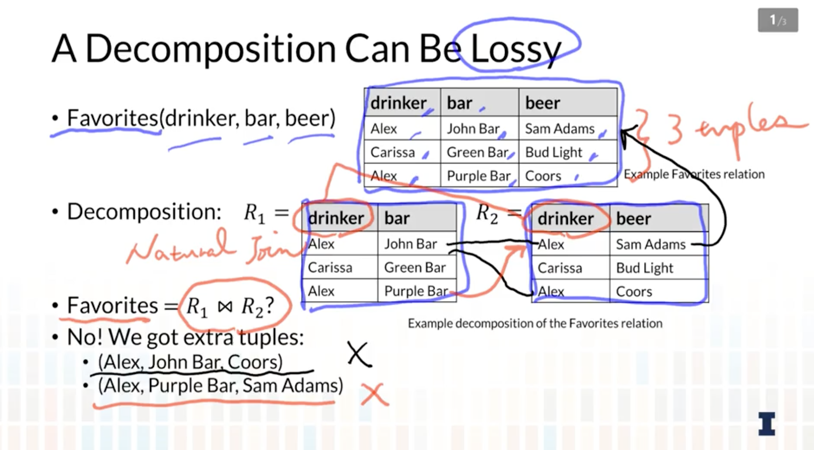

BCNF decomposition is _lossless_.

## 4.9 Dependency-Preserving Decomposition
### Definition
A schema $S$ is dependency preserving if, for every FD $f$ of it:
- $f$ can be checked in a table $T$ in $S$, or
- $f$ can be implied by other FDs that can be checked in a single table in $S$.

> Intuitively, this means that all FDs should be able to be checked without joining tables after the decomposition.

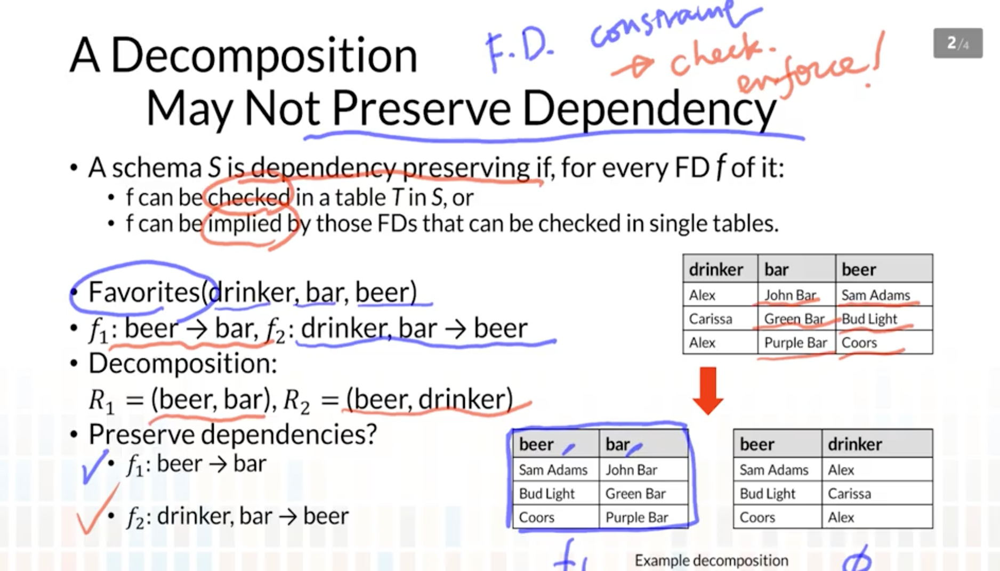

## 4.10 3rd Normal Form
### Definition
A relation $R$ is in 3NF if and only if:
- for every nontrivial FD $A\rightarrow B$ for $R$,
  - $A$ is a superkey for $R$, or
  - $B$ is a __prime attribute__ (i.e., a member of a key) for $R$.

### Why is 3NF acceptable?
3NF is both lossless decomposition and dependency preserving.

It removes "bad FDs" mostly, except those involving key attributes. This way, we avoid splitting a key across two relations.

## 4.11 Multi-valued Dependencies
There are many different kinds of dependencies than FDs, for example,
- multivalued dependencies (MVD),
- inclusion dependencies (IND), 
- join dependencies (JD)

### Intuition
A multi-valued dependency stipulates that a set of attributes may determine a set of values of another attribute, instead of a unique value (as in FD). We use the double arrow symbol $\twoheadrightarrow$ to denote this.
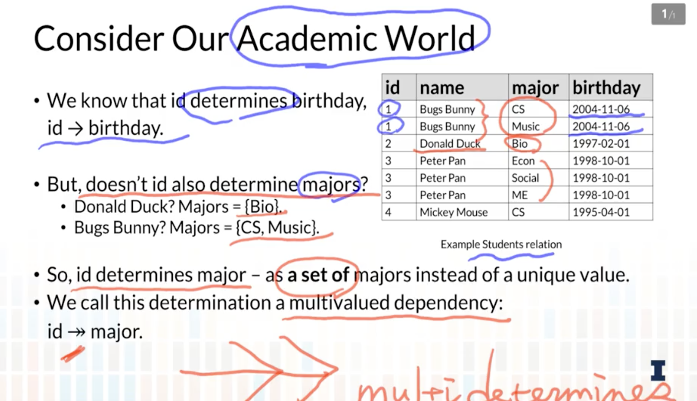

### Definition
- Notation: $A_1, ..., A_m \twoheadrightarrow B_1, ..., B_m$
- We say $A_1, ..., A_m$ multidetermines $B_1, ..., B_m$.
- This means:
  - If two tuples have the same $A_1, ..., A_m$ values, then swapping their $B_1, ..., B_n$ values will yield two tuples that are also in the relation.
- Note, this _will_ lead to some degree of redundancy.

FD is a special case of MVD.

# Chapter 5 Querying Databases: The Relational Way (1)

## 5.1 Querying Databases
> _Why do we design databases?_
> 
> Because we want them to answer questions about the application we are modelling via queries.

### Query Languages
A __query language__ is a "computer language" for asking questions on the data stored in a database.

The design of a query language depends on:
- data model: how is data organized in the database?
- query capabilities: what types of questions can be asked?
- target users: what types of user will use this language (e.g., programmers vs non-programmers)?

An example query language may look as follows:
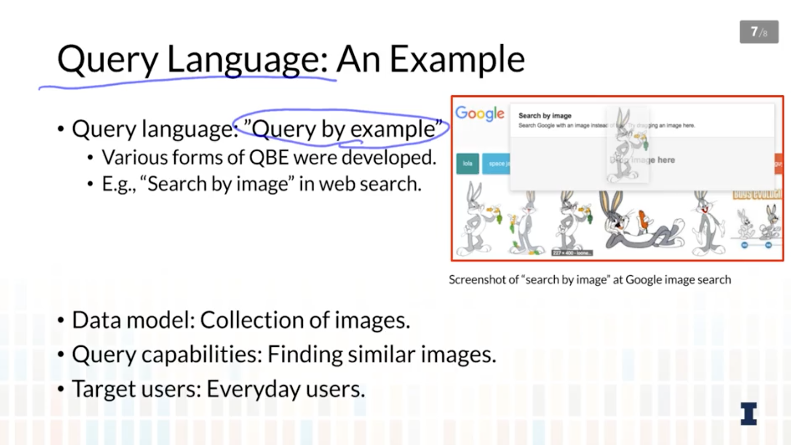

## 5.2 SQL

### Background
SQL stands for _Structured Query Language_. It is a language for querying and manipulating data, created by IBM in 1970s. 

SQL is _declarative_, that is, you only state _what_ you want, and not _how_ you want it. One benefit of declarative queries is that they can be optimized "just-in-time", using the latest information on the data stored.

## 5.3 Basic Form

### Basic Form: SELECT-FROM-WHERE
There are three parts in the SELECT-FROM-WHERE basic form:
- SELECT $A_1, ..., A_n$: the attributes to return
- FROM $R_1, ..., R_m$: the relations to query from
- WHERE $C$: the condition the result set must satisfy

### Query Definition
- Input: Relations $R_1, ..., R_m$ that form a subset of relations in the database
- Output: A new relation with attributes $A_1, ..., A_n$
- Note that the query $Q$ is closed in the "relation space", in that, both its input and output are relations.
- Thus, we can think of a query _as a relation_ (e.g., views).

### Meaning of a Query
Given a SQL query
```SQL
SELECT A_1, ..., A_n
FROM R_1, ..., R_m
WHERE C
```
we may translate it to relational algebra as follows:
$$\pi_{A_1, ..., A_n}(\sigma_C(R_1 \times ... \times R_m))$$

That is, we first perform cartesian product between relations $R_1, ..., R_m$. Then, we filter the results with the condition $C$. Finally, we output the filtered tuples with attributes $A_1, ..., A_n$.

### FROM Clause
N/A

### SELECT Clause
- Not only can we select attributes $A_1, ..., A_n$ with the SELECT clause, but we can also transform expressions into attributes: `SELECT ..., expression AS name, ...`.
  - Here the expression is a combination of one or more values, operators, or SQL functions that evaluates to a value.

### WHERE Clause
- Conditions in the WHERE clause may take on various forms. For example, we may directly reference attributes, perform arithmetic operations, string operations (e.g., `UPPER(bar) = 'GREEN BAR'`), pattern matching with `LIKE` operator (e.g., `bar LIKE '%Green%'`).
  - In pattern matching, `%` is used to match any _string_, and `_` is used to match any _character_.

## 5.4 Null Values
### Motivation
Observe that the following two quries are NOT equivalent:
```SQL
SELECT bar, beer FROM Sells WHERE price < 5.00 OR price >= 5.00
```
```SQL
SELECT bar, beer FROM Sells
```
where there are `NULL` values for the attribute `price` in the result tuples.

### Null Values
Tuples in SQL relations may have `NULL` as value for some attributes due to various reason. Two common ones are:
- missing values: we don't know what the value should be
- inapplicable: the value is not relevant in the context

### Comparing with NULL Values
- In SQL, the result of a logical expression may be either `TRUE`, `FALSE`, or `UNKNOWN`, i.e., __3-valued logic__. 
- When `NULL` is compared with any value, the result is `UNKWOWN`.
- A tuple is returned from a query only if its truth value is `TRUE`. That is, any tuples with truth value `UNKWOWN` from the condition is _not_ returned.

### Truth Table for 3-Valued Logic
|AND|Unkwown|
|---|---|
|True|Unknown|
|False|False|
|Unknown|Unknown|
---
|OR|Unkwown|
|---|---|
|True|True|
|False|Unknown|
|Unknown|Unknown|
---
|NOT|Unknown|
|---|---|
|-|Unknown|

### Testing for NULL
We can use the `IS NULL` or `IS NOT NULL` operator to select/de-select `NULL` values.

## 5.5 Subqueries
### Definition
- A __subquery__ is parenthesized SELECT-FROM-WHERE query contained in another query.
- It itself may contain subqueires.
- It can either return a relation or a single constant value.
- It can be used in anywhere: FROM, WHERE, or SELECT.

### Subqueries Returning Single Constants
- If a subquery is guaranteed to return a _single_ tuple with a _single_ attribute, then its result can be used as scalar value, which is a special case of a relation.
- These subqueries may be used in WHERE or SELECT.
- The "single" tuple in the result may be guaranteed by, for example:
  - key constraints: if a key is specified in the condition, then we can be sure that only one tuple will be matched
  - aggregate functions that produces a scalar value

### Subqueries that Return Relations
- This is the more general case.
- These subqueries can be used anywhere a relation is expected, i.e., WHERE and FROM.

### Using Relation-Subqueries in WHERE Clause
We will need to define new operators on sets of tuples now that we are working with subqueries that can return relations.

- `IN` / `NOT IN`: tests if the tuple is a member of the relation
  - `tuple IN relation`
- `EXISTS`/`NOT EXIST`: tests if the relation is not empty
  - `EXISTS relation`
- `ANY`
  - `X <op> ANY relation`: tests if the condition `X <op> Y` holds for at least one `Y`, which is any value from the selected attribute from the relation.
  - This operator requires that `relation` has only one attribute, so that `X <op> Y` is an operation on scalar values.
  - `op` can be any binary operators on scalars (e.g., $=, <=$, etc.).
- `ALL`
  - `X <op> ALL relation`: tests if `X <op> Y` holds for _all_ tuples in the relation, where `Y` is any value from the relation.
  - Similar to `ANY`, `ALL` also requires that the relation has one attribute.

# Chapter 6 Querying Databases: The Non-Relational Ways (1)

## 6.1 Motivations
There are multiple ways of physically storing the data in databases other than the relation approach (where data are organized into tables that can be joined together when queried). We could also store data in documents or graphs. Do we still want to "join" or "assemble" these entities when quering?

A question we need to answer when querying non-relational data is, 
- what are the key "concepts" that we wish to support?
  - In relational databases, we have the concepts of `reduction`, `selection`, `projection`, `aggregation`, etc.
- Are these concepts enough to fulfill queries we want to ask?
- How do we implement these concepts?
- How are they different from the relational model?

## 6.2 Querying Document Databases - MongoDB

### Concept Mapping from the Relational World
In relational databases, data are stored in databases, which consist of tables (relations) that have rows (tuples). In MongoDB, data are stored in databases, organized into __collections__ of __documents__.
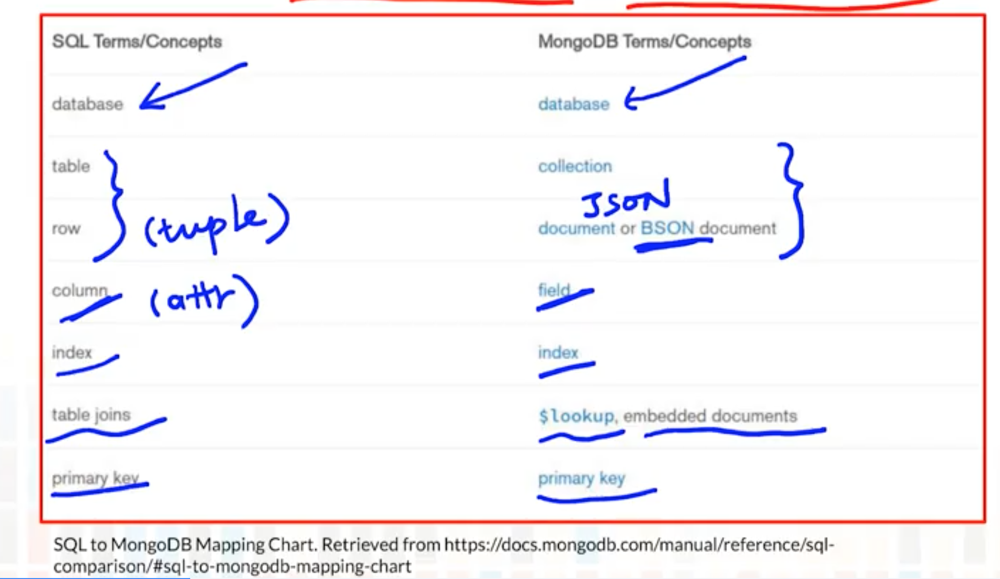

### Shell Methods
__Shell methods__ are the main way to interact with a MongoDB.
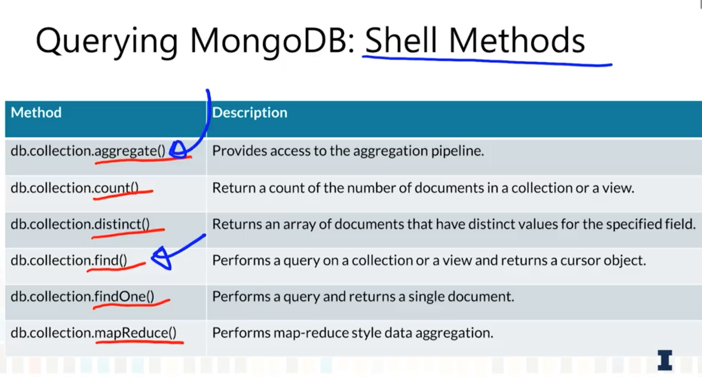

Note that the ones listed above are __collection methods__, meaning that they operate on collections. That is, the methods either:
- operate within the scope of an individual collection, or
- operate on one collection from another (primary collection), i.e., asymmetrical.

## 6.3 Querying Document Databases: Basic Operations

### The basic operation: `db.collection.find()`
`db.collection.find(query, projection)`
- `query`: (optional) the filter to apply, e.g.,
  - `{brewer: "AB InDev"}` for equality condition
  - `{price: {"$lt": 5}}` for inequality condition
- `projection`: (optional) the fields to return
  - E.g., `{name: 1, "_id": 0}`
  - To include a field, use the value `1`. Otherwise, use `0`.

### Binary Operations: Union, Difference, Cartesian Product
> Note: MongoDB does not support join or operations on multiple collections from its design philosophy. This is because all relevant information to a piece of data has been stored within a document (i.e., denormalized). There is _typically_ no need to join with other relations to retrieve more information.

Because of the lack of native support for multi-collection operations, we will have to implement the logic ourselves. For example, if we want to get a list of beers that are made by the brewer "AB InBev" and are priced less than $5, we will have to make two separate `find()` calls to `Beers` and `Sells` collection, and then perform the intersection on the result sets ourselves.

### Renaming
Renaming is not supported natively via the `find()` function. However, a similar construct in Aggregate can achieve similar effects.

### Summary
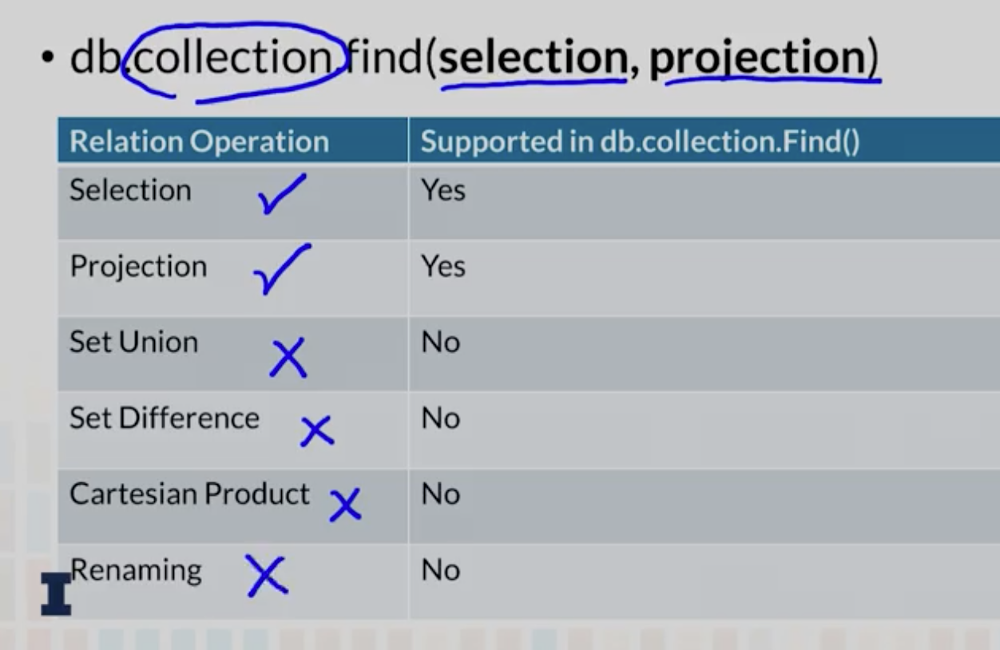

## 6.4 Querying Document Databases: Complex Structures
Compared to relational databases, where data is normalized, document databases _denormalize_ data, often leading to complex nested document structures.

When dealing with complex structures, we need to be able to support the following operations:
- complex values (the value in the condition that we are comparing against is a subdocument)
  - e.g., `db.CompleteDrinkers.find({frequents: {name: "Green Bar", addr: "Green St"}})`
- complex attributes
  - e.g., `db.CompleteDrinkers.find({"frequents.addr": "Green St"})`
- complex operations
  - e.g., `db.CompleteDrinkers.find({"drinks.beer.name": {$all: ["Bud", "Sam Adams"]}})`

### Embedding vs Referencing
Embedding is when we put a subdocument under a parent document as-is, with its full content, whereas referencing if where we simply leave a reference to the nested object, which can be retrieved at run-time.
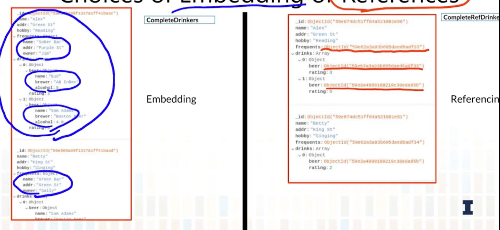

> Again, if we wish to query for a nested field that was referencing to another document, there is no native support for it. We would have to do it ourselves.

## 6.5 Aggregates
### Basic Form
`db.collection.aggregate(pipeline, options)`
- `pipeline`: an array of aggregation operations/stages to perform
- `options`: configuration for the `aggregate` function

### Stages
The stages in `aggregate` are similar to that of relational databases.
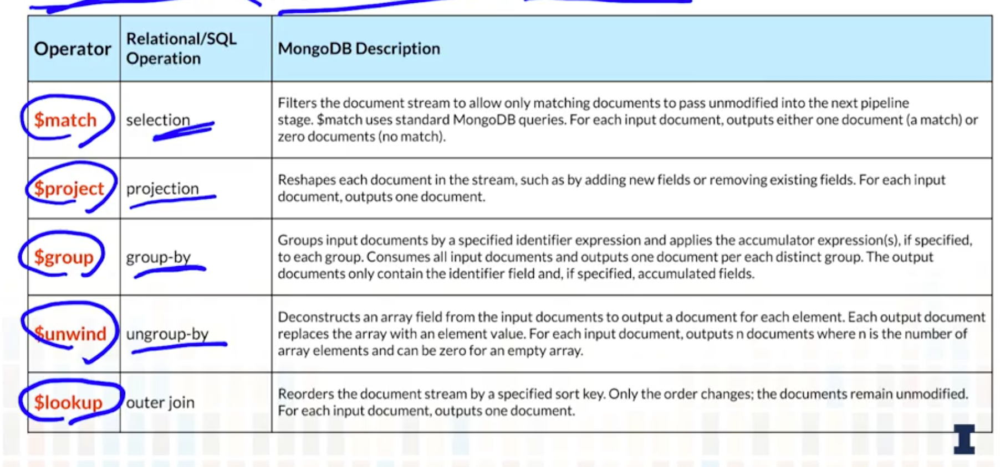

> Note that `find()` is actually a special case of `aggregate()`. We can write `find({condition}, {attributes})` as `aggregate({$match: {conditions}}, {$project: {attributes}})`. But `aggregate()` can support many more operations, including __renaming__.

To rename a field, we can simply supply the new attribute name in the `$project` stage like this: `{$project: {"_id": 0, beer: "$name"}}`. This will rename the attribute `name` to `beer`.

### Spotlight: The `Unwind` Opeator
This operator is especially useful when there is an array of values in an attribute of a document. For example, we have the following complement document:
```JSON
{
  "name": "My Bar",
  "addr": "123 This Rd.",
  "sells": [
    {
      "beer": {
        "name": "Bud",
        "alcohol": 5
      },
      "price": 5,
    },
    {
      "beer": {
        "name": "Bud Light",
        "alcohol": 2.5
      },
      "price": 4.5,
    }
  ]
}
```
After applying the unwind operator, we get the following two documents:
```JSON
[
  {
    "name": "My Bar",
    "addr": "123 This Rd.",
    "sells": {
      "beer": {
        "name": "Bud",
        "alcohol": 5
      },
      "price": 5,
    }
  },
  {
    "name": "My Bar",
    "addr": "123 This Rd.",
    "sells": {
      "beer": {
        "name": "Bud Lite",
        "alcohol": 2.5
      },
      "price": 4.5,
    }
  },
]
```

This could be useful for any subsequent aggregation processing.

## 6.6 The Case for Joins

### Why do we need joins?
- To reduce redundancy
- To avoid arbitrarily deep nesting of documents
- To avoid having to constantly reorganize the database to fit the query need

According to MongoDB, there are often a need to interact with multiple collections at the same time, especially when it comes to analytics and reporting.

### Joins in MongoDB
MongoDB added support for __outer (left) equi-join__. This performs the following action:
- For every document in the left collection, find all documents with equi-matching condition in the right collection.